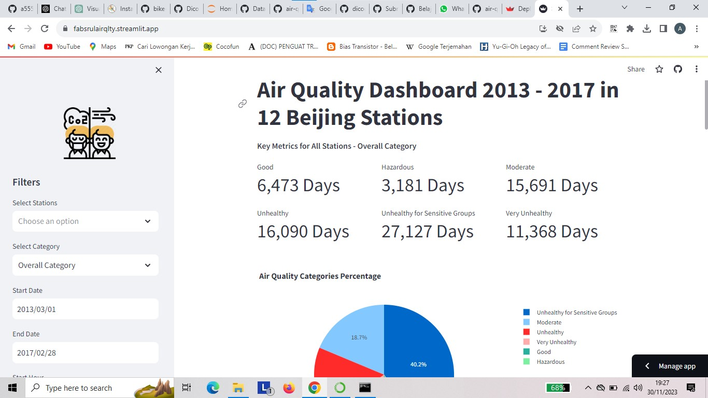

# Air Quality Data Analysis with Python - Dicoding



[Air Quality Dashboard Streamlit App](https://fabsrulairqlty.streamlit.app/)

## Table of Contents
- [Overview](#overview)
- [Project Structure](#project-structure)
- [Installation](#installation)
- [Usage](#usage)
- [Data Sources](#data-sources)
- [Exploratory Data Analysis](#exploratory-data-analysis)
- [Visualization](#visualization)

## Overview
Proyek ini merupakan proyek analisis dan visualisasi data yang berfokus pada data kualitas udara. Ini mencakup kode untuk perselisihan data, analisis data eksplorasi (EDA), dan dasbor Streamlit untuk eksplorasi data interaktif. Proyek ini bertujuan untuk memberikan wawasan tentang pola, korelasi, dan tren kualitas udara di wilayah tertentu berdasarkan data yang tersedia.

## Project Structure
- `data/`: Direktori yang berisi file data CSV mentah.
- `notebook.py`: Skrip Python untuk perselisihan data, EDA, dan menjawab pertanyaan analisis.
- `app.py`: The Streamlit dashboard application.
- `README.md`: This documentation file.

## Installation
1. Clone this repository to your local machine:
```
git clone https://github.com/Armands1234/streamlit-air-quality.git
```
2. Install the required Python packages by running:
```
pip install -r requirements.txt
```

## Usage
1. **Data Wrangling**: Data wrangling scripts are available in the `notebook.py` file to prepare and clean the data.

2. **Exploratory Data Analysis (EDA)**: Explore and analyze the data using the provided Python scripts. EDA insights can guide your understanding of air quality patterns.

3. **Visualization**: Run the Streamlit dashboard for interactive data exploration:

```
streamlit run app.py
```
Access the dashboard in your web browser at `http://localhost:8501`.

## Data Sources
The project uses air quality data from [Belajar Analisis Data dengan Python's Final Project](https://drive.google.com/file/d/1RhU3gJlkteaAQfyn9XOVAz7a5o1-etgr/view) offered by [Dicoding](https://www.dicoding.com/).

## Exploratory Data Analysis
Meringkas temuan dan wawasan utama dari proses EDA.

## Visualization
Sertakan visualisasi yang dibuat oleh dasbor Streamlit.

## Credits
Proyek ini dikembangkan sebagai bagian dari kelas "Belajar Analisis Data dengan Python" di Akademi Dicoding – kursus komprehensif tentang analisis data dengan python. Terima kasih khusus kepada Dicoding Academy yang telah menyediakan sumber daya, bimbingan, dan platform pembelajaran yang berharga.
